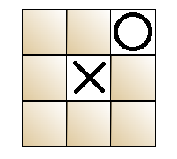

# 🎮 DOOZ: A Minimalistic Two-Player Tic Tac Toe Game

**DOOZ** is a simple, clean, and dependency-free Tic Tac Toe game built with **vanilla JavaScript**, **HTML**, and **CSS**. The game is played in the browser and supports **two human players** on the same device. It's an ideal project for beginners who want to learn JavaScript DOM manipulation and game logic without frameworks or libraries.




## 🚀 Features

- 🎲 **Two-player gameplay:** Play locally with a friend.
- 🧠 **Classic win conditions:** Horizontal, vertical, and diagonal victory detection.
- 🧼 **Clean and readable source code:** Easy to understand and extend.
- 🖼️ **Simple UI:** Intuitive layout with minimal styling.
- 🏆 **Winner announcement:** Clearly displays the winner with a custom message.
- 🌐 **Browser-based:** Runs directly in any modern web browser.
- 🧩 **No external dependencies:** 100% vanilla JavaScript, HTML, and CSS.


## 📂 Project Structure

```bash
DOOZ/
├── images/
    ├── O.png        
    └── X.png
├── index.html       # Main HTML file
├── styles.css       # Styling rules
└── app.js           # Game logic in JavaScript
```

## 💡 How to Play

1. Clone or download the repository.
2. Open the `index.html` file in your web browser.
3. Take turns clicking on the grid to place your marks (Player 1: X, Player 2: O).
4. The game will display a message when a player wins.
5. Refresh the page to play again


## 🔧 Setup Instructions

No installation required. Just open the index.html file in a browser:
``` bash
git clone https://github.com/matin-alizadeh/DOOZ.git
cd DOOZ
open index.html
```


## 📈 Potential Improvements

- Add AI opponent (minimax algorithm)
- Highlight winning line
- Add draw/tie detection and messaging
- Add score tracking between rounds
- Improve mobile responsiveness


## 📄 License

This project is open-source and free to use under the MIT License.
